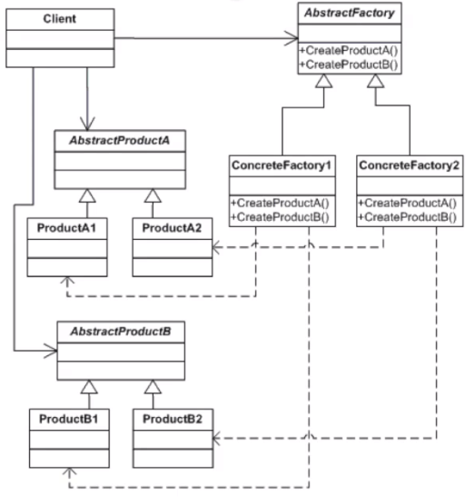

design-patterns

Creational Design Patterns: 
1. Abstract Factory Pattern:
   

   + provide an inferface for creating families of related or dependent objects without specifying concrete classes
   + objects can be grouped into a hierarchy that encapsulates distinct platforms consisting of a suite of related objects
   + calling code works with abstract interfaces and classes and does not need to know the exact types of the objects created by the factory

2. Builder Pattern

   + separete the construction of a complex object from its representation so thaht you can use the same construction process for different types of objects
   + parse a complex representation and create one of several target objects out of it

3. Factory Method Pattern

   + define an interface for creating objects, but you want to let subclasses decide which class to instantiate
   + decuple requesting objects from creating objects
   + calling code doesn't need to know what types of objects are created

4. Prototype Pattern
   
   + use a prototype object instance for creating new objects, by copying the prototype
   + constructing a new object from zero takes a lot of time and effort
   + move construction logic away from the calling code

